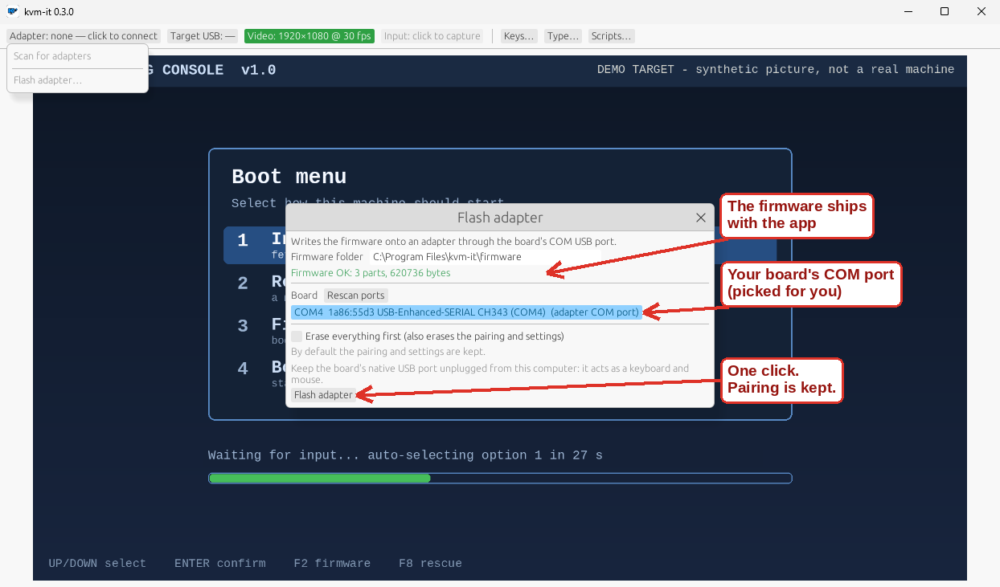

<p align="center"></p>

# kvm-it

**A KVM for the machine that has nothing on it yet.**

See it. Type at it. Install it. No software on the target, no network, no hundred-dollar IP-KVM: an ESP32-S3 dev board (~$10), a cheap
HDMI capture card, and one app.

<p align="center"></p>
<p align="center"><sub>The real app (0.4.0, Windows 11). The picture is a synthetic demo target, never a real machine.</sub></p>

## Three steps

1. **Get the parts.** An ESP32-S3 board with two USB-C ports (**COM** and **USB**) and a USB HDMI capture card. Details: [get started](docs/getting-started.md).
2. **Install the app.** Download from [Releases](https://github.com/spilloid/kvm-it/releases): a signed `.msi`/`.zip` for **Windows 11**, an
   `.AppImage` for **Linux**. Double-click or `chmod +x`. That is the whole "dev environment": **no Rust, no Docker, no drivers, no DLLs to hunt down.**
3. **Plug in.** In the app: **Adapter > Flash adapter…** (one click; the firmware is inside the app), pair once, and drive.

<p align="center"></p>

## What you get

- **See and drive the target in one window.** Click the picture and your keyboard and mouse belong to the target; **Ctrl+Alt+Esc** gives
  them back (that chord is never sent). It works from the BIOS splash onward: if the target takes a USB keyboard, kvm-it can drive it.
- **The keys your PC would swallow.** One-click Ctrl+Alt+Del, Win, Alt+Tab, PrintScreen and more; on Windows, the rest go to the target too.
- **Zero-step reconnect.** Pair once. Move the cables to the next machine and the app reconnects by itself.
- **Replayable setup scripts.** Native TOML or imported DuckyScript: text, keys, chords, delays, and *wait-for-the-screen* steps, so one slow
  install screen does not wreck everything after it. Preview and dry-run before anything is typed; abort leaves nothing held down.
- **Boots a bare machine from the network.** One click turns on the adapter's read-only USB drive carrying iPXE (off by default): pick it in the target's boot menu and
  reach an installer, WinPE or a rescue image (UEFI targets; Secure Boot support is signed but only tested in a virtual machine so far: see the status table).
- **Flashes its own adapter,** in the app, and keeps the pairing.
- **Safe with secrets.** Passwords are masked, never logged, never saved. Pairing needs physical presence: plug it in or press its button.
- **Open.** MIT-licensed; the wire protocol, firmware and every review round are in this repo.

The target needs no software, drivers, network or Bluetooth.

```
Target HDMI out ──► USB capture card ──► your PC ──► kvm-it (live video)

Your keyboard/mouse ──► kvm-it ──► Bluetooth LE ──► ESP32-S3 ──► USB HID ──► target PC
```

Everything the app does is also on the command line:
`kvmit scan | status | type "text" | key ctrl alt delete | run script.toml [--dry-run] | import payload.txt | flash`.

**[Full walkthrough on the docs site](https://spilloid.github.io/kvm-it/)** or [docs/getting-started.md](docs/getting-started.md). Read
the [hardware guide](docs/hardware.md) once: which USB-C port goes where, what the LED and BOOT button mean.

**Hacking on it?** Building from source (that is where Rust and Docker live): [docs/developing.md](docs/developing.md).

## Status: v0.4.0

Labels are strict: **built** = compiles; **host-tested** = automated tests pass in CI/containers;
**hardware-verified** = run on a physical board; **VM-verified** = run in a Windows 11 virtual machine on a Linux
host with the Bluetooth adapter and the capture card passed through over USB (the real radio and the real card, but
not bare-metal Windows).

| Area | State |
|---|---|
| Firmware: USB keyboard + mouse (boot HID) | **hardware-verified** (enumeration via `lsusb`; self-test typed) |
| Firmware: protocol dispatcher, dedup, keepalive, LED language, BOOT gestures | host-tested |
| Firmware: BLE (bonding, pairing window, GATT), BOOT GPIO | **hardware-verified** (BOOT opens the window; LE SC bond; HELLO/STATUS over GATT; bonded reconnect) |
| Firmware: LED driver (GPIO48), BOOT gestures | **hardware-verified** (fast blue while pairing; 10 s BOOT hold: yellow ramp, three red flashes, fast blue, bond erased) |
| Protocol v1 spec + shared vectors (C and Rust) | host-tested |
| Desktop: client (ack/retry/keepalive), script engine, DuckyScript import, layout | host-tested |
| Desktop: BLE transport + BlueZ pairing | **hardware-verified** on Linux/BlueZ (Intel AX201): `scan`, `pair`, `status` (90 ms RTT); `type`/`key` **hardware-verified** into a Windows 11 target (every printable US-ASCII character, checked on screen through the capture card) |
| Desktop: BLE on Windows (WinRT pairing, `scan`, `status`, `unpair`, faster-connection request) | **VM-verified**: pairing with no system dialog, `status` (30 ms RTT with the fast connection, 120 ms without), `key --hold`; sustained mouse motion at 60 and 125 frames/s no longer collapses the link. `kvmit type` was not run from Windows. Bare-metal Windows: not tested |
| Desktop: V4L2 capture | **hardware-verified** with an HDMI capture card (MacroSilicon `345f:2109`): 1920x1080 frame of a live Windows 11 desktop via `kvmit video snap` |
| Desktop: Media Foundation capture (Windows) | **VM-verified** with the same MacroSilicon card: `video list`, a 1920x1080 MJPEG `video snap`, live video in the GUI, and a notice (not a frozen frame) when the card is unplugged mid-stream. The YUY2 path is untested |
| Desktop: egui GUI, v0.1.0 layout (left panel) | **maintainer-checked** on Linux with an adapter and a target (2026-10-03), including the input-ownership changes |
| Desktop: egui GUI, v0.2.0 layout (top-bar status chips, popups, run-log strip) | **VM-verified** on Windows (chips, popups, capture, error dialog). **Not yet checked on Linux** since the redesign; exposes a UI Automation tree for screen readers and tests. No automated GUI tests |
| Desktop: Windows keyboard grab (Win, Alt+Tab, ... go to the target while captured) | **VM-verified**: Win and Alt+Tab never reach the controller while captured, a held key reaches the adapter, Ctrl+Alt+Esc releases and the keyboard returns, and a hung GUI cannot trap the keyboard (the helper stops swallowing after 3 s). Not verified: non-US layouts and IMEs, bare metal. Linux has no equivalent |
| Desktop: shared client change (mouse motion split into 127-unit frames, ordered before clicks) | host-tested; **not re-run on a Linux board yet** |
| Windows as the controller (app) | **v0.4.0**: runs in a Windows 11 VM with real hardware passed through (rows above); **not verified on bare-metal Windows**. Windows as the *target* sees a USB keyboard and mouse, and since firmware 0.2.0 also a small read-only drive (a drive letter and possibly an AutoPlay prompt); a Windows target seeing the drive has not been exercised |
| Desktop: flash the adapter (`kvmit flash`, GUI **Flash adapter…**) | **hardware-verified** on Linux with a physical board over its COM port (`kvmit flash`): verified write of bootloader, partition table, app and (firmware 0.2.0) the boot-drive image; the pairing survives a default flash and is wiped by `--erase-all`; refuses while the adapter's own USB port is plugged in (also with `--any-port`). **VM-verified** on Windows 11 (board's COM bridge passed through): the same CLI and the GUI wizard, end to end. an interrupted write was recovered by flashing again. **Not exercised:** the Linux GUI wizard, bare-metal Windows, a factory-fresh board (the full-erase path, run only on boards that already had firmware) |
| Firmware 0.2.0: read-only USB boot drive carrying iPXE, **off until turned on** (Adapter popup / `kvmit boot-drive`) | Protocol/dispatcher/config: **host-tested** (firmware logic tests, shared vectors, Rust parsing). **Hardware-verified** with the real adapter on a Linux host, the toggle driven from the Windows 11 VM over Bluetooth (`kvmit boot-drive`): the final firmware (app sha256 6a5d0525… (the v0.4.0 release build; later bundles are the same firmware source rebuilt, which changes the timestamp inside)) flashed over COM as four images with the pairing kept, booting with the drive off; `kvmit boot-drive on` over Bluetooth from the Windows 11 VM re-enumerated it with a read-only disk (3 interfaces) whose contents read back identical to the shipped image, a raw SCSI WRITE(10) sent at it was refused (DATA PROTECT) and the disk was unchanged; `off` returned it to two interfaces; the firmware then reports 0.2.0 (2026-10-05). **Not exercised on hardware:** the GUI button. Earlier hardware checks on a first build of the image (drive always on): enumerates beside the keyboard and mouse as a 4 MiB write-protected disk; the whole disk reads back byte-identical; mounts read-only; raw SCSI writes sent straight at the device (WRITE(10) as DATA PROTECT; WRITE(6)/(12), FORMAT UNIT, WRITE SAME, UNMAP as invalid commands) are refused and the disk is unchanged; pairing survived the new partition table. **VM-verified** (UEFI VM, Secure Boot **off**): the final image as a USB disk falls through when no key is pressed, and with a key gets an address, fetches the demo over HTTPS and boots a network Linux; and a private script on it chained to a Windows PE over HTTPS and brought it to its prompt. **Secure Boot (next release, not yet shipped):** the drive now carries the iPXE project's signed shim and iPXE; in a UEFI VM with the stock Microsoft keys it starts with Secure Boot on or off, runs our script, fetches over HTTPS and refuses an unsigned kernel; **no real PC with Secure Boot on has been tried, and this image has not been flashed to the adapter yet**. **Not exercised:** the GUI button and the packaged app's four-image flash (the CLI flasher was used), a real PC booting from the drive, a Windows host seeing it, legacy BIOS (unsupported) |
| Built-in OOBE script | template only, never run on a real OOBE |
| Session recording | planned |

## Security note

kvm-it types credentials into other machines. Secrets are never logged and never persisted by default.
Read [docs/security.md](docs/security.md) before using it for anything you care about.

## Repository

| Path | Purpose |
|---|---|
| `firmware/` | ESP-IDF project (ESP32-S3, TinyUSB HID, NimBLE) |
| `protocol/` | [Wire protocol v1](protocol/SPEC.md) and generated golden vectors |
| `desktop/` | Rust workspace: `kvmit` app (CLI + GUI) and its library crates |
| `docs/` | The [docs site](https://spilloid.github.io/kvm-it/) source: UX and scripting, architecture, hardware, security, roadmap, review log |
| `scripts/` | Containerised build, test and flash helpers |

## License

MIT. See [LICENSE](LICENSE).
