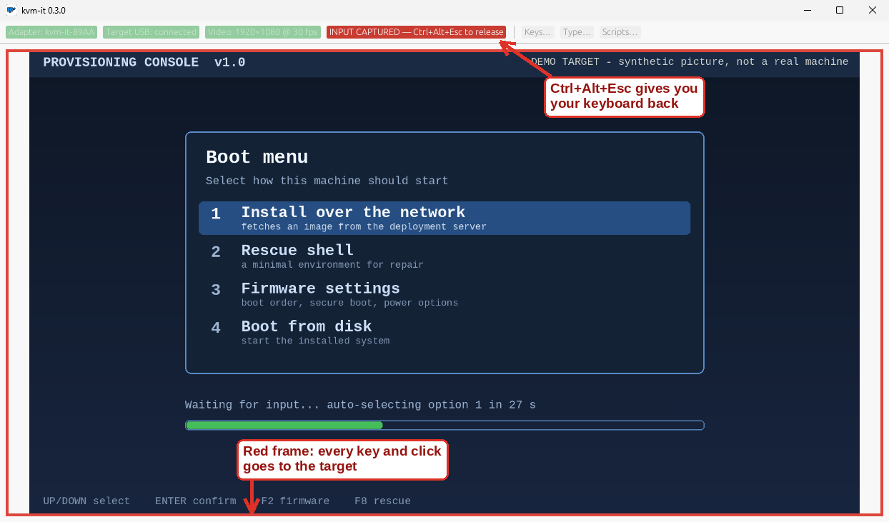
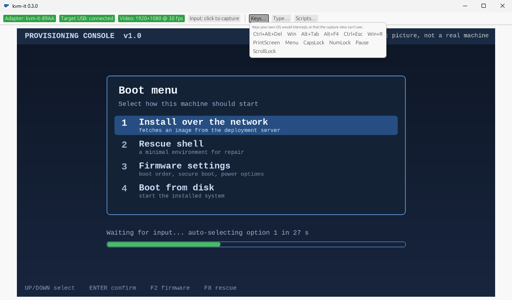
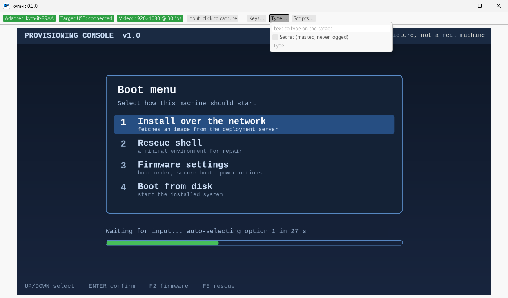

# Get started

Three things to do: **get the parts, install the app, plug in.** No toolchains, no terminal, no yak.

## 1. The parts

| Part | What to get |
|---|---|
| **The hands** | An ESP32-S3 dev board with **two** USB-C ports, labelled **COM** and **USB**. About ten bucks. We test on the YD-ESP32-23; details in the [hardware guide](hardware.md). |
| **The eyes** | A USB HDMI capture card, the cheap generic kind (it just has to be a normal USB video device). No drivers. Optional: without one you get no picture, but you can still type and click. |
| **The brain** | Your computer, on **Windows 11**, **Linux** or **macOS** (Apple silicon), with Bluetooth LE. The *target* can be anything with a USB port and an HDMI output, running anything or nothing. |

## 2. The app

**Windows 11:** download `kvmit-vX.Y.Z-windows-x64.msi` from the [download page](index.html#download) (or the [Releases page](https://github.com/spilloid/kvm-it/releases)) and
double-click it. That adds **kvm-it** to your Start menu. Prefer no installer? Grab the `.zip`, unzip it anywhere, and run
`kvmit-gui.exe`. It is one self-contained program that uses only what Windows already has.

**Linux:** download `kvm-it-X.Y.Z-x86_64.AppImage`, `chmod +x` it, run it. It wants BlueZ and the desktop libraries any
normal distro (Debian 12 / Ubuntu 22.04 or newer) already has.

**macOS (Apple silicon):** download `kvm-it-X.Y.Z-macos-arm64.dmg`, open it and drag **kvm-it** to
Applications. It is not notarized yet, so the first time macOS blocks it: open *System Settings > Privacy & Security* and
click **Open Anyway**. It asks for Bluetooth and Camera access when it first needs them; to send Cmd+Tab and friends to
the target, add kvm-it under *Privacy & Security > Accessibility* (Ctrl+Option+Esc releases capture).

> **No Rust. No Docker. No DLL scavenger hunt.** If you can double-click an installer, you are done with this step. (Building
> from source is for tinkerers: [developing.md](developing.md).)

Two small Windows things: you need a graphics driver with OpenGL 2.0 or newer (any real PC has one; the app tells you if not), and
for the video, *Settings > Privacy & security > Camera > Let desktop apps access your camera* must be on.

## 3. Flash the adapter (once, in the app)


1. Plug the board's **COM** port into your PC. **Leave the other one (USB) unplugged.** That one is a real keyboard and mouse
   that takes orders from kvm-it, and plugged into the computer you are flashing from it would be typing into your own machine.
   (kvm-it refuses to flash if it spots one.)
2. Open **kvm-it**, click the **Adapter** chip, **Flash adapter…**, **Flash adapter**.
3. Wait for *Flashed and verified.* That is the whole job.

The firmware ships inside the app, so there is nothing to download. If your adapter was already running kvm-it, its pairing
survives; if it is straight out of the bag, tick *Erase everything first* (there is no pairing to lose yet). Command-line
fans: `kvmit flash`. (Verified on boards that already had firmware; a factory-fresh board has not been through it yet, so
tell us how it goes.)

## 4. Pair (once)

1. Move the cable: plug the adapter's **USB** port into the **target**. (COM can stay plugged in or not.)
2. For **15 seconds** after it powers up, it accepts a new pairing. Missed it? Press **BOOT** briefly: that reopens the window
   for 5 minutes. No physical access, no pairing. That is the entire security model, and it is a feature.
3. In kvm-it: **Adapter** chip, **Scan for adapters**, **Pair & connect**. On Windows this pairs with no system dialog at all.

From then on, move the cables to the next machine and the app reconnects by itself.

## 5. Drive


The top bar is the whole control panel; the picture is the rest of the window. Green is working, amber is in progress, red is
broken, grey is idle.

1. **Adapter**: is it connected? Click it to scan, pair, disconnect, flash.
2. **Target USB**: does the target see the adapter as a keyboard and mouse? (An indicator, not a button.)
3. **Video**: click it, pick your capture card, and the target's screen appears. One click switches cards; **Rescan** finds one you
   plugged in later.
4. **Capture**: click the picture (or this chip). Your keyboard and mouse now belong to the target.
5. **Keys · Type · Scripts**: the three buttons that do the clever bits, below.



**Getting out:** press **Ctrl+Alt+Esc**. That chord is never sent to the target, so it can never get stuck over there. On Windows, keys your
PC would normally keep for itself (Win, Alt+Tab, Ctrl+Esc, Alt+F4) go to the target too while you are captured.

**Keys** sends the chords your PC would swallow: Ctrl+Alt+Del, Win, Alt+Tab, PrintScreen and friends. (Ctrl+Alt+Del and Win+L cannot be
intercepted by any program on Windows, so this is how you send them.)

 

**Type** types a string for you. Tick *Secret* for passwords: masked, never logged, never saved.

**Scripts** replays a setup flow: Windows OOBE, an installer, a BIOS tour. Drop `.toml` or DuckyScript files in your scripts folder
(`~/Documents/kvm-it/scripts`), pick one, read the preview, **Dry run** it first (it types nothing), then **Run**. Abort leaves nothing
held down. More in [scripts and replay](ux.md).

 

Everything is also on the command line:

```bash
kvmit scan
kvmit status
kvmit type "hello"
kvmit key ctrl alt delete
kvmit run setup.toml --dry-run
kvmit import payload.txt
kvmit flash
```

**Several adapters at once.** Run one `kvmit run` per target, each naming its own adapter and capture card. Take the card's
*key* from `kvmit video list` rather than its path: the key stays the same while a card stays in the same USB port, but
two identical cards can swap `/dev/videoN` numbers when replugged.
A script that never waits on the screen does not need `--video`. Without it, `run` uses the card you last opened in the
app if it is connected; if you never opened one, the only card connected. Otherwise (that card unplugged, several
cards, a remembered card the system names without a location) it stops and asks rather than guess. With more than one
target, always give `--video`: if one target's card is unplugged, "the only card connected" is another target's.

```bash
kvmit video list        # /dev/video2  USB3 Video  (key: USB3 Video @ usb-0000:00:14.0-1)
kvmit --device AA:BB:CC:00:00:01 run setup.toml --video "USB3 Video @ usb-0000:00:14.0-1" --yes &
kvmit --device AA:BB:CC:00:00:02 run other.toml --video "USB3 Video @ usb-0000:00:14.0-2" --yes &
wait
```

Each run is independent, with its own exit status: a failure, or stopping one process, leaves the others running. Every
adapter shares the computer's Bluetooth radio, so how many run smoothly at once has not been measured yet. A run started
in the background cannot answer prompts: give values with `--var`, and run scripts that ask for a secret or have a
`confirm` step in a terminal of their own.

## 6. Boot a machine from the network (new in 0.4.0)

The adapter can also be a tiny **read-only USB drive** with iPXE on it, so a machine with nothing on it can fetch an installer, WinPE or a rescue image over the
network, driven from your desk. **It is off until you turn it on**, so by default your target sees only a keyboard and mouse. (The setting is remembered, so it stays on across power cycles until you turn it off.)

1. In kvm-it, click the **Adapter** chip and **Boot drive: Turn on (restarts adapter)**. (Command line: `kvmit boot-drive on`.) The adapter restarts, so the
   target sees it re-plug, and the drive appears. Turn it off the same way when you are done.
2. With the adapter's **USB** port in the target, open the target's boot menu (usually **F12**, **F11** or **Esc** at power-on; kvm-it's **Keys** button can press
   them for you) and pick the entry that says **kvm-it** (listed as a USB device, "UEFI kvm-it kvm-it HID adapter…").
3. iPXE starts and says *press any key to boot from the network*. Press a key within five seconds and it asks your network for an address and opens the iPXE
   project's public demo menu, which proves the whole path without a server of your own. (If you do nothing it exits and the target carries on with its normal boot
   order, so a target that happens to boot USB first is not hijacked.)

The drive is **read-only by design**: the adapter reports it write-protected and rejects every write, so nothing on the target can ever change it.

If a target's firmware dislikes the extra drive, turn it off (the adapter goes back to presenting just a keyboard and mouse), or flash the previous firmware
from the 0.3.0 release with `kvmit flash --firmware <its firmware folder>`; your pairing is kept.

Honest limits for now: **UEFI only** (not legacy BIOS). **Secure Boot can stay on** on firmware that trusts Microsoft's third-party UEFI CA, because the drive carries the iPXE
project's signed shim and iPXE; but then iPXE only starts signed things (Windows PE through `wimboot` is fine; an unsigned Linux kernel is refused with "Security Policy
Violation"), and some locked-down PCs turn that CA off and refuse the drive. All of that has been run in a virtual machine, not yet on a real PC. And the boot script on the
drive is the demo until editing it from the app lands (developers can change it today: [developing.md](developing.md)).

## When something is off

- **Read the chips first.** They say which link is the problem.
- **The app will not start and shows an OpenGL message:** update the graphics driver. (A virtual machine with no GPU needs a software
  OpenGL.)
- **Video says *not opened*, or stops:** is the card plugged in, and is nothing else using it? On Windows, check the camera setting above.
- **The adapter never appears in a scan:** replug it (15-second window) or press **BOOT**, then scan again. More in the
  [hardware guide](hardware.md).
- **Keys stuck on the target:** *Release all keys* in the **Adapter** popup. If the app crashes, the adapter lets go of everything by
  itself within a few seconds (designed that way; not yet verified on hardware).
- **The target does not offer a "kvm-it" boot entry, or says "Access Denied":** the boot drive is UEFI-only. If it refuses the signed shim, that firmware does not
  trust Microsoft's third-party CA (some locked-down machines); tell us the model. "Security Policy Violation" after iPXE starts means the thing you chained to is not
  signed (see step 6).
- **Flashing says an Espressif USB device is plugged in:** that is the safety check. Unplug the board's **USB** port (and any other ESP
  board) from this computer; keep only **COM**.

## Treat it with care

kvm-it types into other machines, including credentials. Read the [security model](security.md) before you point it at anything you
care about.
