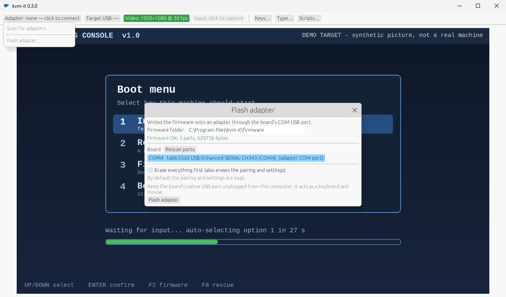

# Hardware setup — YD-ESP32-23 (ESP32-S3-N16R8, rev 2022-v1.3)

## The two USB-C connectors

The board has two USB-C ports. They are **not interchangeable**:

| Port (silkscreen) | Wired to | Use it for |
|---|---|---|
| **COM** | CH343 USB-UART bridge → ESP32-S3 UART0 | **Development**: flashing, serial log. Connect to your controller/dev PC. |
| **USB** | ESP32-S3 native USB (GPIO19/20) | **Target**: this is the keyboard/mouse (and the read-only boot drive, see below) the target computer sees. Connect to the target. |

Evidence from this repo's development host: with only the COM port connected, Linux reports
`1a86:55d3 QinHeng Electronics USB Single Serial` (a WCH CH343) and creates `/dev/ttyACM0`. That matches the
COM port. The silkscreen names above are from the board vendor's documentation; **confirm them on your board**
(the label next to each connector) before relying on them.

### Rules

1. **Target gets the USB port.** In normal operation only the USB port is connected, to the target. The board is
   powered by the target.
2. **Do not plug the USB port into the machine you are developing on** while the self-test is flashed: ~8 s
   after boot the board types `HELLO FROM KVM`, presses Enter and moves the mouse *on whatever machine it is
   plugged into*. Use a separate target, or leave the USB port unplugged while you flash.
3. During development you may connect COM to your dev PC and USB to a test target at the same time. Both ports
   can power the board; if your board revision has a power-selection jumper/solder pad, check it before
   connecting two different computers at once (two hosts feeding 5 V into one board is best avoided). **This
   has not been verified on rev 2022-v1.3 — check the board's schematic or just power via one host.**
4. The firmware keeps its console on UART0 (COM port) on purpose, because the native USB peripheral belongs to
   the HID device.

### Buttons

- **BOOT** (GPIO0, read by the firmware at run time):
  - short press (< 3 s): open the **pairing window** for 300 s (a 15 s window also opens by itself at every
    power-on or RESET; with a bond stored, crash/watchdog reboots do not open it);
  - hold 10 s: **erase the bonded controller** and reopen the window (LED shows progress, below);
  - hold it while pressing RESET: ROM download mode (hardware behaviour, unchanged).
- **RESET** (EN): reboots the chip; the USB device re-enumerates on the target and the adapter comes back
  with its last configuration (name and bond are stored in flash). Like a plug-in, it opens the 15 s pairing
  window.

### Status LED (on-board RGB, GPIO48 — verified on this board 2026-10-03; set
`CONFIG_KVMIT_LED_GPIO` to -1 or another pin if a different board stays dark)

| LED | Meaning |
|---|---|
| white, steady | booting |
| **blue, fast blink** | pairing window open — a controller may pair now |
| blue, brief tick every 1.5 s | a controller is bonded; waiting for it to connect |
| magenta, brief tick every 3 s | nothing bonded and the window is closed; radio is quiet — press BOOT |
| **green, steady** | controller connected, encrypted and handshaken |
| brief white flash | an input command was just applied |
| amber blip every 2 s (on top of anything) | the **target has not enumerated the USB port** (cable, power, suspend) |
| yellow, blinking faster, then solid (BOOT held ≥ 3 s, solid at 10 s) | trust reset in progress; release before 10 s to cancel |
| red, 3 flashes | trust erased |
| red, fast blink | BLE failed to start (USB HID still works) |

Colours are intentionally dim (≤ 40/255).

## Building the firmware yourself (developers)

**You do not need this to use kvm-it:** the app flashes the adapter for you (below), with the firmware inside it. This is for people
changing the firmware. See also [building from source](developing.md).

Requirements: `podman` (or set `CONTAINER_RUNTIME=docker`). Nothing else is installed on the host. The
toolchain is the pinned image `docker.io/espressif/idf:v5.5` (override with `IDF_IMAGE`).

```bash
git clone https://github.com/spilloid/kvm-it && cd kvm-it
scripts/fw.sh test      # host unit tests (no hardware needed)
scripts/fw.sh build     # first build downloads esp_tinyusb from the ESP component registry
```

### Serial-port permission (one-time)

`/dev/ttyACM0` is `root:dialout` mode 0660. Your user must be in `dialout`:

```bash
sudo usermod -aG dialout "$USER"     # then log out and back in
```

Quick temporary alternative (resets on replug/reboot): `sudo setfacl -m u:$USER:rw /dev/ttyACM0`.
If `usermod` reports the group is missing, `getent group dialout` shows whether it exists on your host
(it does on the development host, with no members).

> **Group membership only applies after a fresh login.** `sg dialout -c scripts/fw.sh ...` does *not* work
> with rootless podman (user-namespace mapping fails). Until you re-login, flash with a host-side esptool:
> `python3 -m venv .venv-esptool && .venv-esptool/bin/pip install esptool` then, from `firmware/build`,
> `sg dialout -c ".../esptool --chip esp32s3 --port /dev/ttyACM0 -b 460800 write-flash @flash_args"`.
> This is how the first flash was done on the development host (hash-verified).

### Flash from the app (0.3.0)

The controller can flash the adapter itself, on Linux and Windows, with no ESP-IDF install:



1. Plug the board's **COM** USB port into the computer. **Keep its other (native USB) port unplugged**: it is the keyboard and
   mouse and would type into this computer. The app refuses to flash while it can see any Espressif USB device (`303a:*`) attached, because an adapter's own
   USB port cannot be told from other Espressif boards (and looks generic in download mode): unplug other ESP boards too.
2. GUI: Adapter chip > **Flash adapter…**; or CLI: `kvmit flash --list`, then `kvmit flash`. The firmware that ships with the app
   (a `firmware` folder next to the program, from `firmware/release` in the repo) is used by default; set `KVMIT_FIRMWARE` or
   pass `--firmware <dir>` (a folder with `flasher_args.json` and the three images, e.g. `firmware/build`) to use another.
3. By default only the bootloader, partition table and app are written and the **pairing and settings are kept**. The tool
   checks, from the board itself, that the settings stay where they are. `--erase-all` (GUI: the tick box plus a second
   confirmation) erases everything including the pairing; pair again afterwards.
4. It checks before writing that the chip is an ESP32-S3 with 16 MB of flash, and verifies what it wrote. A flash cannot be
   interrupted safely: do not unplug the board or close the app while it runs. If it fails or is interrupted, just flash
   again (the chip is put into its bootloader by the COM port itself; this recovered a write killed halfway through the app on
   2026-10-04). Only if the board is not found, hold **BOOT** while plugging the COM cable in.

### Flash and watch

```bash
scripts/fw.sh flash                # defaults to /dev/ttyACM0; or: scripts/fw.sh flash /dev/ttyACM1
scripts/fw.sh monitor              # Ctrl-] exits
# or both:
scripts/fw.sh flash-monitor
```

If the device node is different (`ls /dev/ttyACM* /dev/ttyUSB*`), pass it as the second argument.

## The boot drive (firmware 0.2.0)

The USB port can also present a **4 MiB read-only mass-storage drive** (a third USB interface, after the keyboard and mouse, so the two boot-protocol HID interfaces keep the
numbers BIOS/UEFI expects). It holds an EFI system partition with iPXE (`EFI/BOOT/BOOTX64.EFI`) and an `autoexec.ipxe` script. It lives in its own flash partition (`ipxe`,
4 MiB at 0x110000); the settings partition (and so the pairing) has not moved, so existing adapters upgrade in place.

- **Off by default.** Turn it on in the app (Adapter popup > Boot drive) or with `kvmit boot-drive on`; the adapter stores the setting and restarts, because the USB
  descriptor is fixed for a session (the target sees it re-plug). With it off, the descriptor is the keyboard and mouse only (`303a:4008`); with it on, `303a:400a`.
- **Read-only:** the drive reports itself write-protected and the firmware refuses every write.
- **UEFI only.** Pick the "kvm-it" entry in the target's boot menu. Legacy BIOS is not supported: the disk's boot sector just hands over to the next boot device (INT 18h),
  and no partition is marked active, so a legacy BIOS that tries the drive should move on instead of hanging (untested).
- **Inert by default:** the script on the drive waits five seconds for a key press and otherwise exits with a failure status, so a target that boots USB first carries on.
- **Secure Boot must be off** on the target for now: a stock iPXE is unsigned and Secure Boot refuses it.
- **Linux host:** with the drive on, it shows up as a write-protected `/dev/sdX`; `sha256sum` of the whole disk equals `firmware/ipxe/ipxe.img`.
- Serial log lines (`usb_msc`, `usb_hid`) say whether the drive is on, when the target configures the device, and when it first reads the drive.
- Provenance, licence and how to rebuild the image: [`firmware/ipxe/README.md`](https://github.com/spilloid/kvm-it/blob/main/firmware/ipxe/README.md).

## Verification checklist — please report back

Already hardware-verified (2026-10-03): flash over COM; USB enumeration (`lsusb`: `303a:4008`, keyboard + mouse
boot HID; with firmware 0.2.0 and the boot drive turned on the product id is `303a:400a`); the old M2 self-test typed. The 0.1.0 firmware **no longer types at boot** (self-test is the
`KVMIT_SELFTEST` option, default off).

Hardware-verified 2026-10-03 (Surface Laptop 4, Intel AX201, BlueZ 5.x; board on COM only, USB port not on a
target): boot log, BOOT short press opening the window, `kvmit scan`, `kvmit pair` ("paired and connected",
LE Secure Connections bond), and `kvmit status` (protocol v1.0, firmware 0.1.0, 90 ms round trip) including a
bonded reconnect. Items 1, 3 and 4 below are done except the "target USB enumerated" part of 4.

Still unverified on hardware until you report:

1. **Boot log** over COM: `BLE ready, trusted controller none`, `pairing window open for 300 s`, `advertising`.
   *(Verified.)*
2. **LED** behaves per the table above (fast blue while pairing). If dark, GPIO48 is wrong for this board.
   *(Verified 2026-10-03: fast blue in the pairing window; the trust-reset sequence below. Other states not
   individually checked.)*
3. **Pair**: `kvmit pair` on a Linux controller within 15 s of power-on (or after a BOOT press) → "paired and
   connected". *(Verified.)*
4. **Status**: `kvmit status` shows target USB enumerated, a round trip time, firmware 0.1.0. *(Verified
   except target USB, which needs the USB port on a target.)*
5. **Type**: with the USB port on a target, `kvmit type "hello"` and `kvmit key ctrl alt delete` work.
   *(Verified 2026-10-03 into a Windows 11 target: every printable US-ASCII character, chords Win+R and Ctrl+N,
   Enter/Escape; Ctrl+Alt+Del not sent. Read back through the capture card. If the target sleeps or locks
   mid-test, keys go to the lock screen: disable sleep on the target first.)*
6. **Reconnect**: unplug/replug the adapter; `kvmit status` reconnects with no pairing step. *(Verified 2026-10-03:
   physical replug and many COM-triggered power-on resets.)*
7. **Stuck keys**: hold a key via the GUI capture then kill the app (`kill -9`): within ~5 s the target's key
   releases. Disconnecting Bluetooth releases immediately. *(Verified 2026-10-03 with `kvmit key --hold 60s k`
   killed by `kill -9` after 2 s, BLE link left up: autorepeat into Notepad stopped ~3.2 s after the kill (146
   characters at the measured 31/s), count unchanged at +8.6 s and +21.5 s, i.e. the firmware keepalive released it.)*
8. **Trust reset**: hold BOOT 10 s → LED yellow ramp, three red flashes, fast blue; a second controller can now pair.
   *(Verified 2026-10-03: LED sequence as described; log `erasing BLE trust`, 300 s window; the controller's old
   keys are then rejected (0x205) and it pairs afresh.)*
9. **BIOS/UEFI** (if available): keyboard works, and report whether the 5-byte mouse report is accepted.
10. **GUI** (`kvmit`): connect, capture keyboard/mouse, Ctrl+Alt+Esc releases; with a capture card, video shows.

## BLE troubleshooting

- **Opening the COM port resets the board** (the CH343's DTR/RTS lines drive EN/IO0). That reset closes a BOOT
  window but opens the 15 s power-on window, so pair right after opening the serial monitor, or press BOOT.
- **The controller PC can't see the adapter** (`kvmit scan` empty, phone sees it): check the PC's scanner
  before the firmware. Run `sudo btmon -w /tmp/bt.log` during `bluetoothctl --timeout 20 scan le` and count
  `LE Advertising Report`s with `btmon -r /tmp/bt.log`. A healthy scan in a normal room gets hundreds in 20 s.
  On the development laptop (Intel AX201) the controller once got into a state where it passed up ~5 % of
  reports and missed every strong advertiser nearby; `sudo btmgmt power off && sudo btmgmt power on` fixed it.
- **Diagnostic firmware** — `scripts/fw.sh build-diag` builds into `firmware/build-diag/` with
  `sdkconfig.diag` (observer role + `CONFIG_KVMIT_RADIO_DIAG`). At boot it logs the stored bond(s), passively
  scans for 15 s and prints every advertiser with min/avg/max RSSI, then starts normally. To measure the
  PC→adapter path, make the PC advertise the marker first:
  `sudo btmgmt add-adv -d 0CFFFFFF4B564D495444494147 1` (manufacturer data `KVMITDIAG`); the board flags that
  line with `<<< KVMITDIAG HOST`. Remove with `sudo btmgmt rm-adv 1`. Never ship a diagnostic build.
- **Panics on connect**: decode with `xtensa-esp32s3-elf-addr2line -pfiaC -e <elf> <backtrace addrs>` inside
  `scripts/fw.sh shell`. See the NimBLE `slave_conn` note in `firmware/sdkconfig.defaults` for the one found so far.

## HDMI capture card notes

Verified 2026-10-03 with a MacroSilicon `345f:2109` UVC card (MJPEG, up to 1920x1080) on `/dev/video5`:
`kvmit video list` lists it and `kvmit video snap --path /dev/video5 out.png` saves a 1080p frame of the source.

- **"No signal" looks like a flat dark frame**, not an error: every pixel at luma 22. Check with
  `ffmpeg -i out.png -vf signalstats,metadata=print -f null -` (YMAX=22 means no signal).
- **The card may only lock onto a source that appears after it started.** If the source shows the card as a
  display but frames stay flat, replug the card (or `echo 0 > /sys/bus/usb/devices/<port>/authorized`, then `1`).
- **The source must actually drive HDMI**: on Windows, Win+P → Duplicate.
- **Most of this card's MJPEG packets can be empty** (~92 % in one test). `kvmit` skips them; stock `ffmpeg`
  aborts on its default decode-error rate, so any ffmpeg pipeline must tolerate or filter empty packets.

## Known hardware unknowns

- Keyboard SET_IDLE retransmission is not implemented (hosts normally generate their own key repeat); if a BIOS
  fails to auto-repeat held keys, that is why.
- Mouse report is the TinyUSB 5-byte (buttons, X, Y, wheel, pan) descriptor in a boot-protocol interface.
  Some BIOSes only accept 3-4 byte boot mouse reports. If item 6 fails for the mouse, the fallback is a
  boot-compatible 4-byte report; the keyboard is unaffected.
- VID/PID: the firmware uses esp_tinyusb's default Espressif identifiers. Before any public release a proper
  VID/PID allocation is needed (see roadmap).
- PSRAM (8 MB octal) is not enabled in this milestone.
