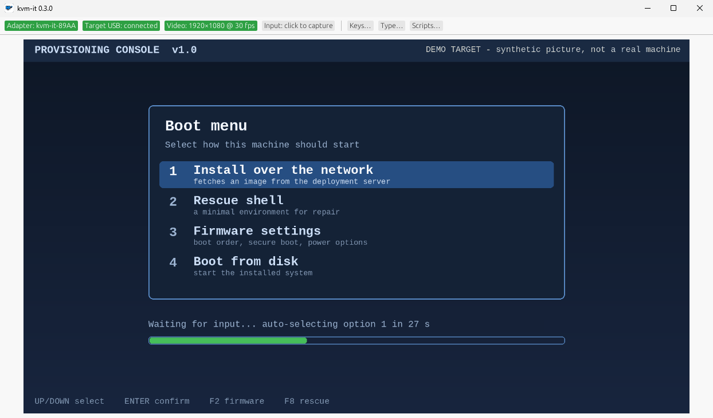

# kvm-it


**A KVM for the machine that has nothing on it yet.** A cheap USB HDMI capture card shows you the target's
screen. A $10 ESP32-S3 board types and clicks for it over plain USB. Nothing is installed on the target: it
works in BIOS/UEFI, OS installers, login screens and recovery shells.

```
Target HDMI out ──► USB capture card ──► your PC ──► kvm-it (live video)
Your keyboard/mouse ──► kvm-it ──► Bluetooth LE ──► ESP32-S3 ──► USB ──► target keyboard + mouse
```



*The pictures on this site are of the real app (0.3.0, Windows 11) with a synthetic demo target in place of a real machine's screen, so nothing private is ever on show.*

## Start here

1. **[Get started](getting-started.md)**: parts list, install, pair, first keystroke.
2. **[Scripts and replay](ux.md)**: automate OOBE, installers and BIOS settings; import DuckyScript.
3. **[Hardware guide](hardware.md)**: ports, LED and button meanings, flashing, troubleshooting.

## How it works and why you can trust it

- **[Security model](security.md)**: physical-presence pairing, one trusted controller, how secrets are handled.
- **[Architecture](architecture.md)** and **[wire protocol](protocol.md)**.
- **[Roadmap](roadmap.md)** and **[development process](dev-process.md)**, including every adversarial review round.

## What is verified

Every claim on this site is labelled **built**, **host-tested** or **hardware-verified**. The authoritative
table is in the [README](https://github.com/spilloid/kvm-it#status-v020).
