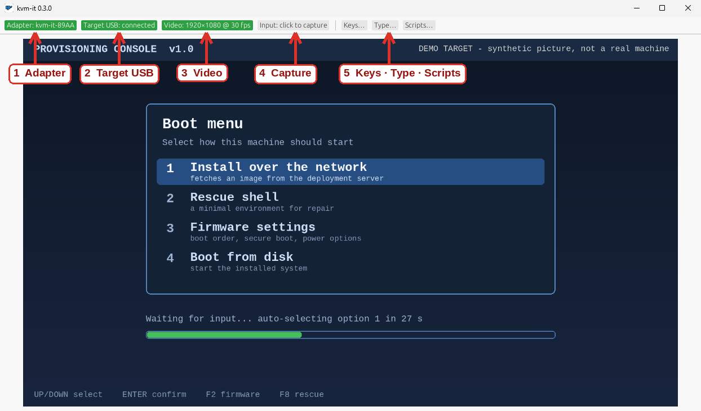

# kvm-it

**A KVM for the machine that has nothing on it yet.**

See it. Type at it. Install it. No software on the target, no network, no hundred-dollar IP-KVM: an ESP32-S3 dev board, a cheap
HDMI capture card, and one app.

*The real app (0.4.0, Windows 11) with a synthetic demo target in place of a real machine's screen, so nothing private is ever on show.*

## How easy is it?

1. **Get the parts.** A ~$10 ESP32-S3 board with two USB-C ports and a cheap USB HDMI capture card.
2. **Install the app.** A signed installer on Windows, an AppImage on Linux. That is the entire "dev environment": no Rust, no Docker, no
   drivers to wrestle.
3. **Plug in.** Flash the adapter from the app (one click, the firmware is inside), pair it once, and drive the target.

**[Get started](getting-started.md)** walks through all of it with arrows on the pictures.

## What it does

- **Sees and drives the target in one window.** Click the picture, and your keyboard and mouse belong to the target. **Ctrl+Alt+Esc**
  gives them back.
- **Works where nothing else does:** BIOS/UEFI, OS installers, login screens, recovery shells. If it takes a USB keyboard, kvm-it can
  drive it from the first splash screen.
- **Sends the keys your PC would swallow:** Ctrl+Alt+Del, Win, Alt+Tab, one click each. On Windows, the rest go to the target too.
- **Boots a bare machine from the network:** turn on the adapter's read-only iPXE drive with one click (off by default; UEFI targets, Secure Boot off for now).
- **Replays setup scripts:** TOML or DuckyScript; text, keys, chords, delays and *wait-for-the-screen* steps. Preview and dry-run first.
- **Flashes its own adapter,** from the app, without touching a toolchain, and keeps the pairing.
- **Keeps your secrets:** passwords are masked, never logged, never saved. Pairing needs your hands on the hardware.

## The docs

- **[Get started](getting-started.md)**: parts, install, flash, pair, drive.
- **[Scripts and replay](ux.md)**: automate OOBE, installers and BIOS settings.
- **[Hardware guide](hardware.md)**: which port is which, the LED, the BOOT button, troubleshooting.
- **[Security model](security.md)**: how pairing works and why you can trust it.
- **[Roadmap](roadmap.md)**: what is next (wired link, network boot, many adapters at once).

## For the curious and the suspicious

- **[Architecture](architecture.md)** and **[wire protocol](protocol.md)**.
- **[Development process](dev-process.md)**, including every adversarial review round: what was found, what was fixed, what was accepted.
- **[Building from source](developing.md)**: that is where Rust and Docker live. You do not need them to use kvm-it.

## What is verified

Every claim here is labelled **built**, **host-tested**, **VM-verified** or **hardware-verified**. The authoritative table is in the
[README](https://github.com/spilloid/kvm-it#status-v040).
