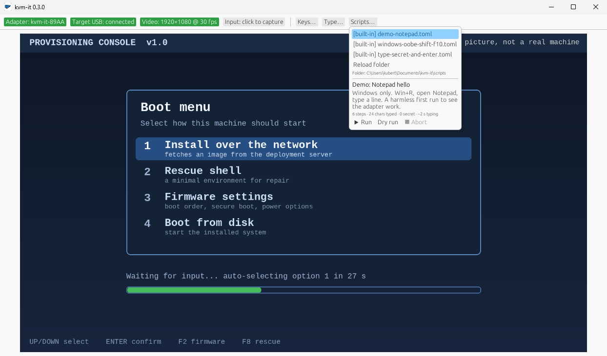
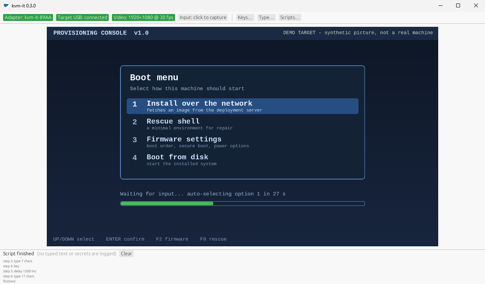

# UX principles

kvm-it is a tool a technician uses eight times in a row, hands busy, in front of a machine that might be at a
BIOS screen. The UX bar is "never make me think about the tool".

1. **Zero-step reconnect.** Moving the cables to the next machine is the whole workflow. BLE, capture and
   (later) trust all re-establish themselves; the UI shows state, it does not ask for action.
2. **State is always visible, never ambiguous.** One row of colour-coded chips: BLE link, target USB mounted,
   capture-card signal, input capture on/off. Green is working, amber is in progress, red is broken, grey is idle.
   Capture-active is unmistakable (red frame + a chip naming the release chord).
3. **Safe by default.** Releasing capture, losing focus, reconnecting or quitting sends release-all. The
   release chord is never forwarded to the target.
4. **Secrets are first-class.** Masked, never logged, per-run by default (see security.md). Typing a secret
   shows progress, never the text.
5. **Anything repeatable is one click** (macro buttons, scripts) and **anything running is interruptible**
   in one keypress, leaving the target with nothing held down.
6. **Honest feedback.** If a command was dropped, the BLE link is degraded, or a script step could not be
   confirmed, say so plainly — a KVM that silently mistypes a password is worse than none.
7. **Fast to first pixel.** Last-used capture device and mode are remembered; the preview appears before the
   user has found the mouse.

## Window layout (0.2.0)

The picture is the window. A single top bar holds everything else:

- **Adapter**, **Target USB**, **Video**, **Input**: status chips filled with their health colour. *Adapter*, *Video*
  and *Input* open the controls they describe (scan/pair/connect, device and mode, capture), and the *Input* chip
  starts capture when clicked. *Target USB* is an indicator only.
- **Keys**, **Type**, **Scripts**: buttons that open popups (chords the OS would swallow; typing a string, masked
  if secret; the script library, variables, preview, run and dry run). Popups stay open until you click outside.
- While input is captured only the *Input* chip is live: every key belongs to the target.
- A running script's log is a strip along the bottom, with Abort, and outlives any popup.
- The chips and buttons are exposed to screen readers and UI Automation by name.


The script library, with a script's preview, variables and the Run / Dry run / Abort buttons; and the run log strip that
stays along the bottom after a (dry) run:

 

*The pictures on this site are of the real app (0.3.0, Windows 11) with a synthetic demo target in place of a real machine's screen, so nothing private is ever on show.*

# Scripting and replay

Goal (from the product owner): bundle replayable scripts, DuckyScript-style, to drive setup flows such as
Windows OOBE, installers and BIOS settings.

## Design decision

Chosen: **a small, structured, declarative script format run by the desktop app (controller side), with a
DuckyScript-compatible text importer, plus screen-aware wait steps.** Alternatives rejected:

- *Run scripts on the ESP32 (Rubber-Ducky style payload storage):* needs firmware changes per feature, no
  video feedback, secrets would have to live in flash, and it cannot adapt to a slow machine. The firmware
  stays a dumb, auditable HID endpoint.
- *A general scripting language (Lua/JS/Python) from day one:* power we do not need yet and a much larger
  trust/sandbox problem. The step model below can grow into one later without breaking script files.
- *Open-loop only (pure DELAY chains):* this is how OOBE automation breaks — one slow screen and every later
  keystroke lands in the wrong place. Because the app already has the HDMI frames, scripts can wait on the
  screen.

## Script file (native, TOML)

```toml
name = "Windows 11 OOBE — local account"
format = 1
description = "Region → keyboard → network → local account"

[vars]
wifi_ssid = { prompt = "Wi-Fi SSID" }
wifi_pass = { prompt = "Wi-Fi password", secret = true }   # asked at run time, never saved
user      = { default = "tech" }

[[steps]]
wait_for = { screen = "oobe-region.png", timeout = "90s", threshold = 0.9 }  # closed loop
[[steps]]
key = "ENTER"
[[steps]]
text = "{{wifi_ssid}}"
[[steps]]
secret_text = "{{wifi_pass}}"
[[steps]]
chord = ["CTRL", "SHIFT", "F10"]
[[steps]]
delay = "1s"
[[steps]]
confirm = "Is the desktop showing? Continue?"   # human gate
```

Step kinds: `text`, `secret_text`, `key`, `chord`, `delay`, `repeat`, `wait_for` (screen match, or
"screen stopped changing for N s", with timeout), `confirm` (human gate), `comment`. Variables via
`{{name}}`. No loops over arbitrary expressions, no shell, no file or network access from scripts.

## DuckyScript import

`kvm-it script import payload.txt` converts the common subset (`REM`, `STRING`, `STRINGLN`, `DELAY`,
`DEFAULT_DELAY`, `ENTER`/`TAB`/arrows, `GUI`/`CTRL`/`ALT`/`SHIFT` combos, `REPEAT`) into the native format and
**lists anything it could not translate** rather than guessing. Layout-dependent characters go through the
selected keyboard layout abstraction, not the payload's assumptions.

## Run-time UX and safety

- **Preview before run:** shows step count, total typed characters (secrets counted, not shown), and any
  `text` that looks like a command. Scripts from files you did not write get an explicit "this will type
  commands into the target" confirmation — a script is remote code execution on the target by design.
- **Controls:** run / pause / step / abort. Abort (and any error) sends release-all. A global abort chord works
  even when the target is mid-typing.
- **Run log:** step names, timings, outcomes; never typed text or secret values.
- **Dry-run** against the live preview without sending anything (highlights what would be typed).
- **Library:** scripts are plain files in a folder (and a built-in set), so they can be versioned in git and
  shared. Signing/trust marks for shared scripts are a later consideration.
- **Recorder (later):** capture a live session into a script, with secrets automatically turned into
  prompted variables.

## Status (0.1.0)

Built and host-tested: native format, variables, `text`/`secret_text`/`key`/`chord`/`delay`/`repeat`/`click`/
`move`/`confirm`, `wait_for` (reference image or screen-stable), DuckyScript import, dry-run, preview with
command warnings, abort-releases-everything. Built-in scripts are templates; **none has been run against a
real OOBE**. Screen matching has only been tested on synthetic frames.

## Milestone placement

Native step engine and text/key/chord/delay/repeat land with the macro system (Milestone 10); the
screen-aware `wait_for`/`confirm`, DuckyScript importer and dry-run follow once video capture (Milestone 7)
and the GUI (Milestone 8) exist. Nothing here requires a protocol change: scripts compile to the same
key/mouse/release-all messages the live path uses.

## Unverified assumptions

- Screen matching reliability across capture cards, scaling and compression artifacts is untested; start with
  coarse change detection and downscaled perceptual comparison, and measure on real OOBE screens.
- OOBE-specific behaviours (e.g. Shift+F10 availability) vary by Windows build and are per-script content,
  not product behaviour.
